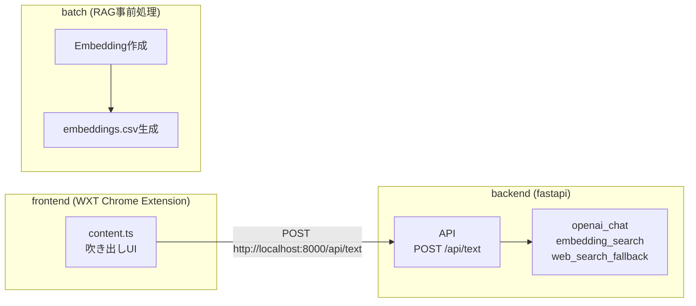

# AGENTS

このリポジトリで作業するCodex向けの最小ガイドです。読みやすさ重視で簡潔に書いています。

## 目的
- Chrome extensionで「おまえをけす方法」のイルカを作る
- 変更は必要最小限・明確な理由付きで行う
- 不明点は推測せず質問する

## プロジェクト概要（現状）
- frontend（WXT）: イルカの吹き出しUIを表示し、入力内容をAPIへ送信
- backend（fastapi）: `POST /api/text` でテキストを受け取り、結果を返す
- batch: RAG用の事前処理（Embeddings作成・`embeddings.csv` 生成）

## 対象範囲
- ルート配下の `frontend/` と `backend/` が主対象

## 環境
- frontend: WXT
- backend: fastapi

## 方針（ハッカソン / 最小構成）
- 最短で動くものを優先し、過剰な設計は避ける
- UI/UXとコア動作に集中し、周辺機能は後回し
- 変更は小さく、検証コストを下げる

## Embeddings / RAG
- ChatGPTのEmbeddingsを利用する想定
- 参照: OpenAI Embeddings Guide（Python）
  - https://platform.openai.com/docs/guides/embeddings?lang=python
- RAGのEmbeddings情報は別途バッチ等で取得し、ハードコーディング前提

## 構成とつながり（mermaid）

## 進め方（基本）
1. 変更前に対象ファイルの現状を確認する
2. 小さな差分で編集し、意図を説明する
3. 影響範囲が不明なら確認質問を入れる

## コマンド・テスト
- 実行コマンドはプロジェクトの指示がある場合のみ使用
- テストは要求があるとき、または影響が大きい変更時のみ提案

## 変更時の注意
- 既存の動作を壊さないことを最優先
- 既存の命名・構成・スタイルに合わせる
- 追加の依存関係や大規模なリファクタは事前相談

## 参考（最低限の構成）
- `frontend/` : フロントエンド
- `backend/` : バックエンド
 - `batch/` : RAG事前処理

## 質問の方針
- 不足情報（実行手順、テスト、設計方針など）がある場合は先に確認する

## 拡張メモ（後で対応）
- content側のAPI連携まわり（送信中表示、エラーハンドリング、Enter送信など）
- 画像UI時の見た目調整（吹き出し/ボタン/余白/影）
